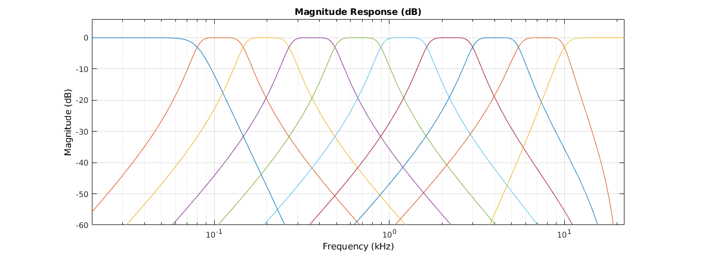

# Example: Spectrum Decompose

_This is an example for desktop C/C++, not for Arduino_.



`Coefficients.m` calculates a series of coefficients for a bank of cascaded BiQuad filters that decompose a sound file into different frequency bands.

You can set the number of bands, the frequency ranges, sample rate, etc. in the `Coefficients.m`. Run it using MATLAB or use the coefficients that were already calculated by me (10 bands, 80 Hz - 10 kHz).  
The result is exported to `Coefficients.h`.

The compile `Spectrum.cpp`:
```sh
make all
```

Finally, add a WAV file `input.wav` in this folder, and run `Spectrum`:
```sh
./Spectrum
```

The program will generate a series of output files containing the separate audio bands.

## Dependencies
You need the [AudioFile](https://github.com/adamstark/AudioFile) library in order to compile it. Download it and move `AudioFile.h` and `AudioFile.cpp` into this folder.